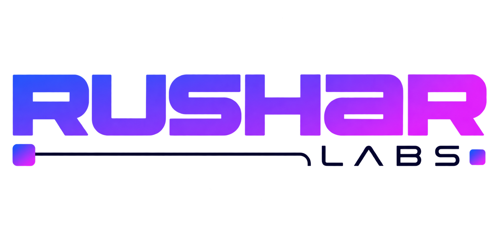

  <picture>
    <source media="(prefers-color-scheme: dark)" srcset="assets/rushar-labs-banner-dark.png">
    <source media="(prefers-color-scheme: light)" srcset="assets/rushar-labs-banner-light.png">
    
  </picture>

  Applied-AI R&amp;D lab. Agent systems, orchestration, observability — built in the open, run in real businesses: marketing, digital products, wealth-tech.

<b>Ideias · Sistemas · Pessoas · Impacto</b> Construindo o que vem depois.

---

### Upstream work

Contributing to [NousResearch/hermes-agent](https://github.com/NousResearch/hermes-agent):

- [#105177](https://github.com/NousResearch/hermes-agent/pull/105177) — dashboard: skip the model-metadata probe against a pinned local endpoint
- [#108780](https://github.com/NousResearch/hermes-agent/pull/108780) — gateway: give lifecycle notices a channel of their own
- [#116367](https://github.com/NousResearch/hermes-agent/pull/116367) — computer-use: fall back to `snapshot_id` for indexed actions the capture did not tokenise

Every change ships with a test that fails before and passes after, a control that passes either way, and the live evidence it rests on.

---

### As quatro dimensões

**Ideias · Sistemas · Pessoas · Impacto** não são etapas — são dimensões conectadas do mesmo trabalho.

- **Ideias** — a investigação, o território das possibilidades: o que ainda não existe e o que pode existir.
- **Sistemas** — a transformação do conhecimento em algo que funciona. Se não roda, não é sistema.
- **Pessoas** — quem constrói, colabora e usa. Tudo aqui é escrito para alguém operar.
- **Impacto** — a mudança que acontece. Não o que foi entregue, mas o que ficou diferente depois.

*Construindo o que vem depois.*

---

### Projetos

- [**House Party Protocol**](https://github.com/rushar-labs/house-party-protocol) — dez kits para Claude Code. Um harness onde nada sai sem uma segunda medição: o revisor roda em outro modelo e não tem ferramenta de escrita. MIT.
